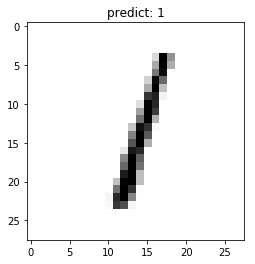
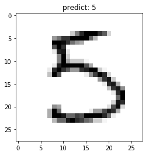
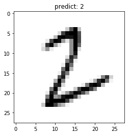
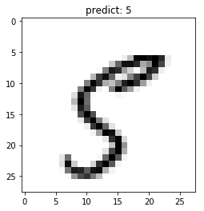

# hello paddle: 从普通程序走向机器学习程序

# 1. 导入相关库


```python
import paddle
import numpy as np
import matplotlib.pyplot as plt

paddle.__version__
```


    '2.0.0'


# 2. 数据准备

## 2.1 数据加载和预处理


```python
import paddle.vision.transforms as T

# 数据的加载和预处理
transform = T.Normalize(mean=[127.5], std=[127.5])

# 训练数据集
train_dataset = paddle.vision.datasets.MNIST(mode='train', transform=transform)

# 评估数据集
eval_dataset = paddle.vision.datasets.MNIST(mode='test', transform=transform)

print('训练集样本量: {}，验证集样本量: {}'.format(len(train_dataset), len(eval_dataset)))
```

    训练集样本量: 60000，验证集样本量: 10000


## 2.2 数据集查看


```python
print('图片：')
print(type(train_dataset[0][0]))
print(train_dataset[0][0])
print('标签：')
print(type(train_dataset[0][1]))
print(train_dataset[0][1])

# 可视化展示
plt.figure()
plt.imshow(train_dataset[0][0].reshape([28,28]), cmap=plt.cm.binary)
plt.show()

```

    图片：
    <class 'numpy.ndarray'>
    [[[-1.         -1.         -1.         -1.         -1.
       -1.         -1.         -1.         -1.         -1.
       -1.         -1.         -1.         -1.         -1.
       -1.         -1.         -1.         -1.         -1.
       -1.         -1.         -1.         -1.         -1.
       -1.         -1.         -1.        ]
      [-1.         -1.         -1.         -1.         -1.
       -1.         -1.         -1.         -1.         -1.
       -1.         -1.         -1.         -1.         -1.
       -1.         -1.         -1.         -1.         -1.
       -1.         -1.         -1.         -1.         -1.
       -1.         -1.         -1.        ]
      [-1.         -1.         -1.         -1.         -1.
       -1.         -1.         -1.         -1.         -1.
       -1.         -1.         -1.         -1.         -1.
       -1.         -1.         -1.         -1.         -1.
       -1.         -1.         -1.         -1.         -1.
       -1.         -1.         -1.        ]
      [-1.         -1.         -1.         -1.         -1.
       -1.         -1.         -1.         -1.         -1.
       -1.         -1.         -1.         -1.         -1.
       -1.         -1.         -1.         -1.         -1.
       -1.         -1.         -1.         -1.         -1.
       -1.         -1.         -1.        ]
      [-1.         -1.         -1.         -1.         -1.
       -1.         -1.         -1.         -1.         -1.
       -1.         -1.         -1.         -1.         -1.
       -1.         -1.         -1.         -1.         -1.
       -1.         -1.         -1.         -1.         -1.
       -1.         -1.         -1.        ]
      [-1.         -1.         -1.         -1.         -1.
       -1.         -1.         -1.         -1.         -1.
       -1.         -1.         -0.9764706  -0.85882354 -0.85882354
       -0.85882354 -0.01176471  0.06666667  0.37254903 -0.79607844
        0.3019608   1.          0.9372549  -0.00392157 -1.
       -1.         -1.         -1.        ]
      [-1.         -1.         -1.         -1.         -1.
       -1.         -1.         -1.         -0.7647059  -0.7176471
       -0.2627451   0.20784314  0.33333334  0.9843137   0.9843137
        0.9843137   0.9843137   0.9843137   0.7647059   0.34901962
        0.9843137   0.8980392   0.5294118  -0.49803922 -1.
       -1.         -1.         -1.        ]
      [-1.         -1.         -1.         -1.         -1.
       -1.         -1.         -0.6156863   0.8666667   0.9843137
        0.9843137   0.9843137   0.9843137   0.9843137   0.9843137
        0.9843137   0.9843137   0.96862745 -0.27058825 -0.35686275
       -0.35686275 -0.56078434 -0.69411767 -1.         -1.
       -1.         -1.         -1.        ]
      [-1.         -1.         -1.         -1.         -1.
       -1.         -1.         -0.85882354  0.7176471   0.9843137
        0.9843137   0.9843137   0.9843137   0.9843137   0.5529412
        0.42745098  0.9372549   0.8901961  -1.         -1.
       -1.         -1.         -1.         -1.         -1.
       -1.         -1.         -1.        ]
      [-1.         -1.         -1.         -1.         -1.
       -1.         -1.         -1.         -0.37254903  0.22352941
       -0.16078432  0.9843137   0.9843137   0.60784316 -0.9137255
       -1.         -0.6627451   0.20784314 -1.         -1.
       -1.         -1.         -1.         -1.         -1.
       -1.         -1.         -1.        ]
      [-1.         -1.         -1.         -1.         -1.
       -1.         -1.         -1.         -1.         -0.8901961
       -0.99215686  0.20784314  0.9843137  -0.29411766 -1.
       -1.         -1.         -1.         -1.         -1.
       -1.         -1.         -1.         -1.         -1.
       -1.         -1.         -1.        ]
      [-1.         -1.         -1.         -1.         -1.
       -1.         -1.         -1.         -1.         -1.
       -1.          0.09019608  0.9843137   0.49019608 -0.9843137
       -1.         -1.         -1.         -1.         -1.
       -1.         -1.         -1.         -1.         -1.
       -1.         -1.         -1.        ]
      [-1.         -1.         -1.         -1.         -1.
       -1.         -1.         -1.         -1.         -1.
       -1.         -0.9137255   0.49019608  0.9843137  -0.4509804
       -1.         -1.         -1.         -1.         -1.
       -1.         -1.         -1.         -1.         -1.
       -1.         -1.         -1.        ]
      [-1.         -1.         -1.         -1.         -1.
       -1.         -1.         -1.         -1.         -1.
       -1.         -1.         -0.7254902   0.8901961   0.7647059
        0.25490198 -0.15294118 -0.99215686 -1.         -1.
       -1.         -1.         -1.         -1.         -1.
       -1.         -1.         -1.        ]
      [-1.         -1.         -1.         -1.         -1.
       -1.         -1.         -1.         -1.         -1.
       -1.         -1.         -1.         -0.3647059   0.88235295
        0.9843137   0.9843137  -0.06666667 -0.8039216  -1.
       -1.         -1.         -1.         -1.         -1.
       -1.         -1.         -1.        ]
      [-1.         -1.         -1.         -1.         -1.
       -1.         -1.         -1.         -1.         -1.
       -1.         -1.         -1.         -1.         -0.64705884
        0.45882353  0.9843137   0.9843137   0.1764706  -0.7882353
       -1.         -1.         -1.         -1.         -1.
       -1.         -1.         -1.        ]
      [-1.         -1.         -1.         -1.         -1.
       -1.         -1.         -1.         -1.         -1.
       -1.         -1.         -1.         -1.         -1.
       -0.8745098  -0.27058825  0.9764706   0.9843137   0.46666667
       -1.         -1.         -1.         -1.         -1.
       -1.         -1.         -1.        ]
      [-1.         -1.         -1.         -1.         -1.
       -1.         -1.         -1.         -1.         -1.
       -1.         -1.         -1.         -1.         -1.
       -1.         -1.          0.9529412   0.9843137   0.9529412
       -0.49803922 -1.         -1.         -1.         -1.
       -1.         -1.         -1.        ]
      [-1.         -1.         -1.         -1.         -1.
       -1.         -1.         -1.         -1.         -1.
       -1.         -1.         -1.         -1.         -0.6392157
        0.01960784  0.43529412  0.9843137   0.9843137   0.62352943
       -0.9843137  -1.         -1.         -1.         -1.
       -1.         -1.         -1.        ]
      [-1.         -1.         -1.         -1.         -1.
       -1.         -1.         -1.         -1.         -1.
       -1.         -1.         -0.69411767  0.16078432  0.79607844
        0.9843137   0.9843137   0.9843137   0.9607843   0.42745098
       -1.         -1.         -1.         -1.         -1.
       -1.         -1.         -1.        ]
      [-1.         -1.         -1.         -1.         -1.
       -1.         -1.         -1.         -1.         -1.
       -0.8117647  -0.10588235  0.73333335  0.9843137   0.9843137
        0.9843137   0.9843137   0.5764706  -0.3882353  -1.
       -1.         -1.         -1.         -1.         -1.
       -1.         -1.         -1.        ]
      [-1.         -1.         -1.         -1.         -1.
       -1.         -1.         -1.         -0.81960785 -0.48235294
        0.67058825  0.9843137   0.9843137   0.9843137   0.9843137
        0.5529412  -0.3647059  -0.9843137  -1.         -1.
       -1.         -1.         -1.         -1.         -1.
       -1.         -1.         -1.        ]
      [-1.         -1.         -1.         -1.         -1.
       -1.         -0.85882354  0.34117648  0.7176471   0.9843137
        0.9843137   0.9843137   0.9843137   0.5294118  -0.37254903
       -0.92941177 -1.         -1.         -1.         -1.
       -1.         -1.         -1.         -1.         -1.
       -1.         -1.         -1.        ]
      [-1.         -1.         -1.         -1.         -0.5686275
        0.34901962  0.77254903  0.9843137   0.9843137   0.9843137
        0.9843137   0.9137255   0.04313726 -0.9137255  -1.
       -1.         -1.         -1.         -1.         -1.
       -1.         -1.         -1.         -1.         -1.
       -1.         -1.         -1.        ]
      [-1.         -1.         -1.         -1.          0.06666667
        0.9843137   0.9843137   0.9843137   0.6627451   0.05882353
        0.03529412 -0.8745098  -1.         -1.         -1.
       -1.         -1.         -1.         -1.         -1.
       -1.         -1.         -1.         -1.         -1.
       -1.         -1.         -1.        ]
      [-1.         -1.         -1.         -1.         -1.
       -1.         -1.         -1.         -1.         -1.
       -1.         -1.         -1.         -1.         -1.
       -1.         -1.         -1.         -1.         -1.
       -1.         -1.         -1.         -1.         -1.
       -1.         -1.         -1.        ]
      [-1.         -1.         -1.         -1.         -1.
       -1.         -1.         -1.         -1.         -1.
       -1.         -1.         -1.         -1.         -1.
       -1.         -1.         -1.         -1.         -1.
       -1.         -1.         -1.         -1.         -1.
       -1.         -1.         -1.        ]
      [-1.         -1.         -1.         -1.         -1.
       -1.         -1.         -1.         -1.         -1.
       -1.         -1.         -1.         -1.         -1.
       -1.         -1.         -1.         -1.         -1.
       -1.         -1.         -1.         -1.         -1.
       -1.         -1.         -1.        ]]]
    标签：
    <class 'numpy.ndarray'>
    [5]


# 3. 模型选择和开发

## 3.1 模型组网


```python
# 模型网络结构搭建
network = paddle.nn.Sequential(
    paddle.nn.Flatten(),           # 拉平，将 (28, 28) => (784)
    paddle.nn.Linear(784, 512),    # 隐层：线性变换层
    paddle.nn.ReLU(),              # 激活函数
    paddle.nn.Linear(512, 10)      # 输出层
)
```

## 4. 模型网络结构可视化


```python
# 模型封装
model = paddle.Model(network)

# 模型可视化
model.summary((1, 28, 28))
```

    ---------------------------------------------------------------------------
     Layer (type)       Input Shape          Output Shape         Param #    
    ===========================================================================
       Flatten-1       [[1, 28, 28]]           [1, 784]              0       
       Linear-1          [[1, 784]]            [1, 512]           401,920    
        ReLU-1           [[1, 512]]            [1, 512]              0       
       Linear-2          [[1, 512]]            [1, 10]             5,130     
    ===========================================================================
    Total params: 407,050
    Trainable params: 407,050
    Non-trainable params: 0
    ---------------------------------------------------------------------------
    Input size (MB): 0.00
    Forward/backward pass size (MB): 0.01
    Params size (MB): 1.55
    Estimated Total Size (MB): 1.57
    ---------------------------------------------------------------------------
    


    {'total_params': 407050, 'trainable_params': 407050}


```python
# 配置优化器、损失函数、评估指标
model.prepare(paddle.optimizer.Adam(learning_rate=0.001, parameters=network.parameters()),
              paddle.nn.CrossEntropyLoss(),
              paddle.metric.Accuracy())
              
# 启动模型全流程训练
model.fit(train_dataset,  # 训练数据集
          eval_dataset,   # 评估数据集
          epochs=5,       # 训练的总轮次
          batch_size=64,  # 训练使用的批大小
          verbose=1)      # 日志展示形式
```

    The loss value printed in the log is the current step, and the metric is the average value of previous step.
    Epoch 1/5
    step 938/938 [==============================] - loss: 0.0325 - acc: 0.9902 - 7ms/step           
    Eval begin...
    The loss value printed in the log is the current batch, and the metric is the average value of previous step.
    step 157/157 [==============================] - loss: 7.0694e-04 - acc: 0.9807 - 6ms/step     
    Eval samples: 10000
    Epoch 2/5
    step 938/938 [==============================] - loss: 0.0028 - acc: 0.9920 - 7ms/step         
    Eval begin...
    The loss value printed in the log is the current batch, and the metric is the average value of previous step.
    step 157/157 [==============================] - loss: 6.0556e-05 - acc: 0.9744 - 6ms/step       
    Eval samples: 10000
    Epoch 3/5
    step 938/938 [==============================] - loss: 0.0070 - acc: 0.9932 - 7ms/step         
    Eval begin...
    The loss value printed in the log is the current batch, and the metric is the average value of previous step.
    step 157/157 [==============================] - loss: 1.0386e-04 - acc: 0.9767 - 6ms/step     
    Eval samples: 10000
    Epoch 4/5
    step 938/938 [==============================] - loss: 0.0012 - acc: 0.9928 - 7ms/step           
    Eval begin...
    The loss value printed in the log is the current batch, and the metric is the average value of previous step.
    step 157/157 [==============================] - loss: 5.0365e-06 - acc: 0.9790 - 6ms/step       
    Eval samples: 10000
    Epoch 5/5
    step 938/938 [==============================] - loss: 0.0416 - acc: 0.9925 - 7ms/step         
    Eval begin...
    The loss value printed in the log is the current batch, and the metric is the average value of previous step.
    step 157/157 [==============================] - loss: 1.2732e-05 - acc: 0.9795 - 6ms/step       
    Eval samples: 10000


# 5. 模型评估测试

## 5.1 模型评估


```python
# 模型评估，根据prepare接口配置的loss和metric进行返回
result = model.evaluate(eval_dataset, verbose=1)

print(result)
```

    Eval begin...
    The loss value printed in the log is the current batch, and the metric is the average value of previous step.
    step 10000/10000 [==============================] - loss: 0.0000e+00 - acc: 0.9795 - 2ms/step         
    Eval samples: 10000
    {'loss': [0.0], 'acc': 0.9795}


## 5.2 模型预测

### 5.2.1 批量预测

使用model.predict接口来完成对大量数据集的批量预测。


```python
# 进行预测操作
result = model.predict(eval_dataset)

# 定义画图方法
def show_img(img, predict):
    plt.figure()
    plt.title('predict: {}'.format(predict))
    plt.imshow(img.reshape([28, 28]), cmap=plt.cm.binary)
    plt.show()

# 抽样展示
indexs = [2, 15, 38, 211]

for idx in indexs:
    show_img(eval_dataset[idx][0], np.argmax(result[0][idx]))
```

    Predict begin...
    step 10000/10000 [==============================] - 1ms/step        
    Predict samples: 10000














### 5.2.2 单张图片预测

采用model.predict_batch来进行单张或少量多张图片的预测。


```python
# 读取单张图片
image = eval_dataset[501][0]

# 单张图片预测
result = model.predict_batch([image])

# 可视化结果
show_img(image, np.argmax(result))
```


# 6. 部署上线

## 6.1 保存模型


```python
# 保存用于后续继续调优训练的模型
model.save('finetuning/mnist')
```

## 6.2 继续调优训练


```python
from paddle.static import InputSpec


# 模型封装，为了后面保存预测模型，这里传入了inputs参数
model_2 = paddle.Model(network, inputs=[InputSpec(shape=[-1, 28, 28], dtype='float32', name='image')])

# 加载之前保存的阶段训练模型
model_2.load('finetuning/mnist')

# 模型配置
model_2.prepare(paddle.optimizer.Adam(learning_rate=0.001, parameters=network.parameters()),
                paddle.nn.CrossEntropyLoss(),
                paddle.metric.Accuracy())

# 模型全流程训练
model_2.fit(train_dataset, 
            eval_dataset,
            epochs=2,
            batch_size=64,
            verbose=1)
```

    The loss value printed in the log is the current step, and the metric is the average value of previous step.
    Epoch 1/2
    step 938/938 [==============================] - loss: 0.0563 - acc: 0.9926 - 7ms/step         
    Eval begin...
    The loss value printed in the log is the current batch, and the metric is the average value of previous step.
    step 157/157 [==============================] - loss: 3.1640e-05 - acc: 0.9775 - 6ms/step       
    Eval samples: 10000
    Epoch 2/2
    step 938/938 [==============================] - loss: 0.0018 - acc: 0.9935 - 7ms/step         
    Eval begin...
    The loss value printed in the log is the current batch, and the metric is the average value of previous step.
    step 157/157 [==============================] - loss: 8.6797e-06 - acc: 0.9783 - 6ms/step     
    Eval samples: 10000


## 6.3 保存预测模型


```python
# 保存用于后续推理部署的模型
model_2.save('infer/mnist', training=False)
```
